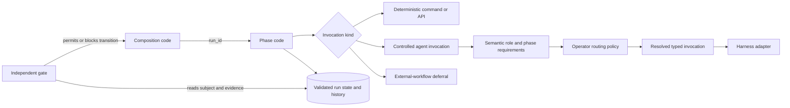

# ADW architecture and composition review

**Review subject:** current Workbench ADW, semantic-role, routing, phase, gate, state, and harness contracts

**Architecture Gate:** `APPLIES` — this review refines a portable workflow contract that future controllers and migrated orchestration resources are expected to consume. It does not implement a controller or runtime.

## Status

- Portable ADW doctrine and primitive blueprints: **IMPLEMENTED AND VERIFIED** as documentation contracts.
- Portable semantic-role contract and Pi controlled-invocation boundary: **IMPLEMENTED AND VERIFIED** at their documented contract/test boundaries.
- Declarative role records, operator role-policy storage, deterministic resolution, a portable controller, child-workflow invocation, and end-to-end role-based orchestration: **PLANNED**.
- Authenticated Claude runtime discovery: **DEFERRED** by the existing migration decision and not reopened by this review.

“Implemented” here means the contract or adapter named by the statement exists. It does not claim that a portable ADW runtime exists.

## Reconstructed current architecture

An ADW is executable orchestration over contracted phases. The current portable model is deliberately layered:



The composition owns run identity, declared phase order, and per-phase failure policy. A phase owns one bounded unit of work, persists material facts, and emits a typed phase result. A gate independently decides whether a transition may occur. State is the sole cross-phase handoff mechanism: a phase receives the run identifier and reloads validated state rather than inheriting memory or an arbitrary payload channel.

For an agentic invocation, the portable side supplies a semantic role plus phase requirements. Operator policy supplies the concrete provider/model/effort choice. The typed invocation records requested routing; the adapter translates it to a harness and records effective routing. Roles cannot grant tools, expand authority, waive gates, select providers, or accept their own output.

The Pi adapter is a thin controlled-invocation boundary, not the controller. Its strict `wb_return` result and requested/effective routing evidence are narrower than a future role-specific handoff envelope. The optional interactive Pi auto-router is currently configured disabled and is not the Workbench resolver. Harness-native subagents remain operator conveniences rather than portable roles or phases.

## Minimum useful workflow kernel

The minimum reusable execution model is four responsibilities, not a new workflow language:

| Responsibility | Existing Workbench primitive | Boundary |
|---|---|---|
| Sequence and failure routing | `composition` | Owns identity, declared order, and per-phase failure policy; does not inspect phase internals |
| One bounded unit of work | `phase` | Declares deterministic, agentic, or deferral invocation; owns its state writes and typed result |
| Durable handoff and evidence | `state` plus versioned `record` / `run history` | The run identifier selects a closed, validated state record; no transcript inheritance or second payload channel |
| Independent transition decision | `gate` | Observes the actual subject and evidence, then permits or blocks a transition |

Supporting artifacts are important but are not additional control-flow primitives:

- a `command` is an agent prompt/report contract;
- a `module` is shared implementation code;
- a semantic role is an invocation requirement contract, not a phase;
- validation is performed by deterministic checks and interpreted by a gate, not represented as a fourth step kind;
- a trigger and queue are optional ingress/scheduling layers added only after unattended demand exists.

Ordinary code is sufficient for a linear sequence, a typed conditional, and bounded failure routing. A branch DSL, workflow AST, recursion facility, generic DAG engine, scheduler, or validation primitive has no demonstrated second consumer in this repository.

## Higher-order composition hypotheses

The review tried to falsify, rather than assume, the claim that ADWs should compose as freely as functions.

| Hypothesis | Verdict | Evidence and consequence |
|---|---|---|
| Any proven ADW can be inserted as a phase | **Falsified for the current contract** | There is no child-run input/output schema, parent/child identity rule, authority intersection, nested gate ownership, cancellation propagation, or retry accounting contract. “Proven” does not define compatibility. |
| A deferral already supplies owned child-ADW composition | **Falsified** | A deferral is specifically a yield to an external workflow the caller does not own. It resumes on independently observed side effects because the callee report is not trusted as a contract. That is not typed subworkflow invocation. |
| Sharing one run identifier makes nesting safe | **Falsified** | Two compositions would then both appear to own order and failure policy for one run. State paths, phase names, budgets, and gate decisions can collide unless an unimplemented namespace/ownership contract is added. |
| Giving the child another run identifier makes nesting safe | **Falsified** | A second identifier requires parent/child provenance, authority and budget derivation, terminal-status propagation, cancellation, evidence import, and resume semantics. None is currently defined. |
| Reusing a phase entry point is sufficient for current reuse | **Supported** | The existing phase/state/gate boundary already permits independent execution and recomposition without creating a second orchestration owner. This is the smallest supported reuse unit. |
| An owned nested ADW could become valid later | **Plausible but PLANNED** | It first needs a real consumer and an explicit typed invocation contract covering the missing boundaries above. It must not be inferred from the current word “composition.” |
| Parallel graphs, recursion, or races belong in the minimum kernel | **Falsified** | They require isolation, claims, cancellation, live accounting, deterministic joins, and conflict policy. Existing doctrine correctly treats these as demand-driven additions, not baseline semantics. |

The resulting rule is narrow: **compose current ADWs by reusing contracted phase entry points. Treat an external workflow as a deferral. Do not call an owned ADW as a typed child workflow until a separate child-invocation contract is justified and implemented.**

## Important boundaries

### Cross-phase handoff

Only the run identifier crosses as the handoff selector. Phase results, artifacts, and configuration are persisted in validated state/history and reread by the next phase. A composition may inspect typed execution status and gate decisions to route control; it may not reach into arbitrary phase artifacts or add a parallel piping channel.

This resolves an earlier documentation ambiguity that alternately described the prior command report as crossing the phase boundary. A command report crosses the command-to-phase boundary. A phase persists the validated result before another phase consumes it.

### Control flow

The portable contract currently guarantees declared phase order and a failure policy per phase. Bounded correction can route through `return_to`, but that does not imply a general graph runtime. Success-dependent branching may be ordinary composition code over typed outcomes when a real workflow requires it; inventing a workflow syntax is explicitly out of scope.

### Invocation and routing

The Core Four remain context, model, prompt, and tools for each invocation. Semantic roles constrain reusable judgment requirements; authority and return contracts surround the invocation but do not replace the Core Four. Capability resolution happens before invocation assembly. The adapter must not reclassify the role or silently choose a different route.

### Acceptance and authority

A completed phase is not a passing gate. A passing gate is not human acceptance. Human acceptance is not shipping authority. Nesting or delegation cannot increase the parent authority envelope, and no role or child can approve its own output.

## Findings and dispositions

1. **Semantic-role separation is sound — accepted.** The current contract separates role, phase, permission, gate, model alias, and harness-native subagent and accurately marks executable role routing as planned.
2. **Pi routing provenance is sound at the adapter boundary — accepted with documented limit.** Explicit versus fallback input, requested versus effective routing, and strict result validation are tested. No semantic resolver exists, and none is claimed.
3. **Cross-phase handoff wording was contradictory — corrected.** Primitive documentation now identifies persisted state as the sole phase-to-phase channel and locates command reports at the command-to-phase boundary.
4. **“Proven ADW” reuse overclaimed current semantics — corrected.** The doctrine now distinguishes phase reuse, external deferral, and planned typed child-workflow invocation.
5. **The minimum execution kernel was implicit — corrected.** Composition, phase, state/records/history, and gate are now named as the minimum control responsibilities; optional ingress and speculative workflow-language features remain outside it.
6. **No runtime implementation change is justified — accepted.** There is no repository evidence for building a controller, child-workflow runtime, classifier, or workflow DSL during this review.

## Architecture Review verdict

`ARCHITECTURE REVIEW: PASS`

The reviewed contracts are coherent after the bounded documentation corrections above. No material implementation defect was found because the controller/resolver/subworkflow runtime is not implemented and is not represented as implemented. The principal residual risk is that planned AIDD Phase 5 orchestration could accidentally turn harness-native delegation or prose sequencing into a portable controller; the refined boundaries are intended to make that violation testable during scoping.

## How to trace this system

1. Start with [`../workbench/foundations/Agentic_Engineering/06_ADW_COMPOSITION.md`](../workbench/foundations/Agentic_Engineering/06_ADW_COMPOSITION.md).
2. Inspect the [`composition`](../workbench/foundations/Agentic_Engineering/primitives/composition.md), [`phase`](../workbench/foundations/Agentic_Engineering/primitives/phase.md), [`state`](../workbench/foundations/Agentic_Engineering/primitives/state.md), and [`gate`](../workbench/foundations/Agentic_Engineering/primitives/gate.md) blueprints.
3. For agentic phases, follow [`14_SEMANTIC_AGENT_ROLES.md`](../workbench/foundations/Agentic_Engineering/14_SEMANTIC_AGENT_ROLES.md) to the [Agent Invocation Module](../workbench/handbook/15_THE_AGENT_INVOCATION_MODULE.md).
4. For the Pi realization and requested/effective routing evidence, follow the cross-repository [semantic routing architecture](../../Architecture/semantic-agent-routing.md) and the [Pi adapter contract](../../dotfiles/pi/adapters/workbench/README.md).
5. Treat the migration handoff as checkpoint evidence, not as an authority that can override any owning contract above.

## Completion evidence

```text
IMPLEMENTATION: PASS — documentation/contract refinements only; no runtime implementation authorized or added
TESTS: PASS — Pi adapter contract tests, 5 passing
VALIDATION: PASS — Workbench structural check, 113 files and 451 internal links; TypeScript; Biome; scoped diff check
ARCHITECTURE REVIEW: PASS
ARCHITECTURE DOCUMENTATION: PASS
DOCUMENTATION VALIDATION: PASS — 13 architecture links and one Mermaid block structurally checked
```

The installed interactive auto-model configuration was parsed and confirmed to have `enabled: false`. Mermaid CLI was unavailable, so rendering was not claimed. Existing unrelated working-tree changes in the Workbench and dotfiles repositories were preserved.
