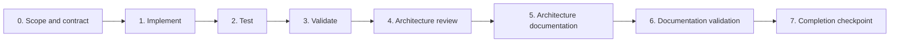
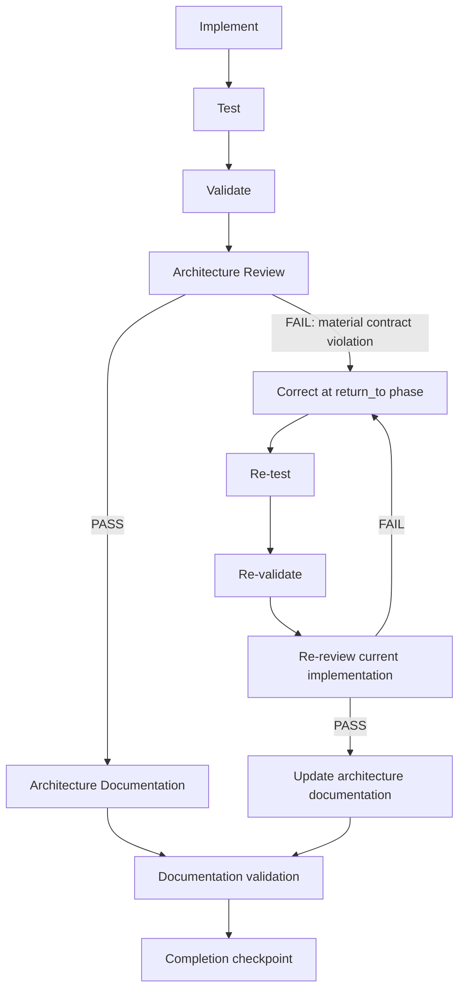

# 🏛️ Completing a substantial subsystem

A substantial subsystem is not complete when its code and tests are complete. Its implementation, validation, architectural review, and architecture documentation are one development process because a system that works but cannot be traced, reviewed, or repaired by its owner is not a finished engineering result.

This is the canonical procedure for implementing a new substantial subsystem or materially changing an existing one. Project instructions, migration plans, implementation briefs, architecture reviewers, and future ADWs/controllers should reference this file rather than restating it.

## Classify the work before implementation

The implementing actor records exactly one of these in the completion evidence:

```text
ARCHITECTURE GATE:
APPLIES
```

or:

```text
ARCHITECTURE GATE:
NOT APPLICABLE — <reason>
```

The gate generally **applies** when the change introduces or materially changes one or more of:

- runtime behavior or meaningful control flow;
- several cooperating modules;
- state or persistence;
- an external process or system;
- deterministic tooling;
- agent/tool invocation;
- an adapter or harness integration;
- authority, security, or permission boundaries;
- an important data flow;
- concurrency, retries, or recovery;
- durable evidence or provenance;
- an authored/generated or build/runtime relationship;
- an API or contract consumed by another subsystem.

Typical gated work includes a deterministic analysis backend, controller, agent invocation module, capability resolver, multiplexed executor, substantial harness adapter, memory subsystem, or substantial external-system integration.

The full standalone gate normally does **not** apply to a small guidance-only skill, typo or documentation correction, isolated prompt wording, mechanical rename, semantically unchanged regeneration, trivial helper, or narrowly scoped test-only change. The reason still has to be recorded; silence is not classification.

This is a practical boundary judgment, not a score. When uncertain, apply the gate if a future engineer would need an architectural reconstruction to change or debug the result safely.

## The lifecycle



For Architecture-Gated work, every stage is part of completion. Review and documentation are not optional cleanup and cannot be left pending while the subsystem is called complete.

The stages define **what semantic work and deterministic evidence must exist**. They do not require one parent agent to perform every stage, and they do not select models. An ADW/controller may invoke separate [semantic roles](../foundations/Agentic_Engineering/14_SEMANTIC_AGENT_ROLES.md) for discovery, planning, implementation, architecture review, or documentation while deterministic code retains sequencing and gates. That is an available composition, not a mandatory roster. Workflow phase is not model, and workflow phase is not necessarily the parent agent.

The procedure uses the existing task lifecycle rather than inventing another task-state enum: scope/contract is held in `scoped`/`ready`, implementation in `building`, test and validation in `validating`, architecture review in `reviewing`, architecture documentation and its validation in `documenting`, and the completion checkpoint precedes `acceptance_pending`.

A future controller may record per-stage outcomes such as `PASS`, `FAIL`, `DEFERRED`, `BLOCKED`, or `HUMAN_DECISION_REQUIRED`. Those labels describe this procedure's evidence; they do not replace the canonical task state, check result, or gate-decision vocabularies.

## Step 0 — Scope and contract

Before implementation:

1. Identify the subsystem boundary and intended behavior.
2. Identify who owns the implementation and contract.
3. Identify implemented and planned consumers separately.
4. Identify inputs, outputs, and important transformations.
5. Identify human, code, agent, harness, and external-system authority boundaries.
6. Read the relevant existing contracts and implementation, not only summaries.
7. Identify authored sources and generated artifacts.
8. Identify runtime, build-time, optional, and reference-only dependencies.
9. Record behavior that is deferred, planned, or not runtime-verified.
10. Classify the Architecture Gate explicitly.
11. Map acceptance criteria to implementation and checks.
12. For each agentic stage, identify the needed semantic responsibility, context freshness/isolation, authority ceiling, and return contract; leave concrete model/effort selection to operator routing policy.

Do not design speculative future architecture. Scope the smallest coherent subsystem that satisfies the current contract.

**Stage evidence:** boundary, contract, ownership, consumers, dependencies, status distinctions, criteria/check map, and Architecture Gate classification.

## Step 1 — Implement

Implement the smallest architecture that satisfies the scoped contract.

- Agents reason where semantic judgment is required.
- Deterministic code owns deterministic behavior.
- Code owns sequencing, schemas, checks, gates, state, accounting, retries, and permission enforcement where applicable.
- Harness-specific behavior does not silently become portable doctrine.
- Generated artifacts are regenerated from authored sources and are not edited independently.
- Upstream or reference material does not silently become a runtime dependency.
- Scope, authority, and unrelated work remain intact.

**Stage evidence:** bounded diff, authored/generated ownership, implementation entry points, and deviations from scope.

## Step 2 — Test

Test behavior at the boundary that carries the contract. Prefer deterministic tests for deterministic code.

Cover, where applicable:

- successful behavior;
- meaningful edge cases;
- invalid input and contract failures;
- boundary and integration behavior;
- structured failure and recovery behavior;
- absence of prohibited hidden dependencies.

Do not add tests that cannot fail, assert implementation trivia without contract value, or exist only to increase coverage.

**Stage evidence:** executed focused test records with scope, result, provenance, and caveats.

## Step 3 — Validate

Run every applicable repository and package check discovered from instructions, manifests, scripts, and CI. Unit tests alone do not establish completion.

Applicable validation may include:

- schema and structural checks;
- type, format, and lint checks;
- deterministic builds;
- generated-artifact drift checks;
- package verification;
- link and documentation checks;
- forbidden-reference or dependency scans;
- harness-independent contract checks;
- broader regression checks;
- `git diff --check`.

Record an inapplicable check explicitly with its reason. Do not weaken a check to obtain green output.

**Stage evidence:** complete expected-check set compared with executed results, including failures and inapplicability.

## Step 4 — Architecture Review

When the Architecture Gate applies, review only after implementation and validation have produced a current subject. Use a fresh context separate from implementation where practical, with sufficient reasoning capability for the subsystem's complexity. A workflow may select an architecture-review semantic role and let operator policy resolve its current model/effort. Portability requires independence and adequate capability; it does not prescribe a model, provider, or harness.

The reviewer reconstructs the architecture from current source, tests, contracts, generated artifacts where relevant, execution evidence, and current documentation. The implementing actor's summary is a claim to check, not the review's source of truth.

Review:

1. purpose;
2. entry points;
3. modules/components;
4. important functions;
5. call relationships;
6. inputs and outputs;
7. data transformations;
8. state and persistence;
9. external dependencies;
10. authority boundaries;
11. deterministic-code versus agent responsibility;
12. harness boundaries;
13. failure paths;
14. recovery behavior;
15. invariants;
16. provenance and evidence;
17. authored/generated ownership;
18. implemented and planned consumers;
19. integration status;
20. known limitations;
21. implemented, verified, deferred, and planned behavior.

Explicitly inspect for responsibility leakage, hidden runtime dependencies, unnecessary harness coupling, model reasoning replacing deterministic behavior, unclear ownership, weak provenance, ambiguous failure handling, accidental upstream dependencies, generated/authored confusion, duplicated responsibility, and contract violations.

Do not redesign working code because another design is aesthetically preferable.

- A **material contract violation** makes `ARCHITECTURE REVIEW: FAIL` and routes work back to the phase that introduced it.
- An accepted, non-material limitation may coexist with `ARCHITECTURE REVIEW: PASS` only when it is recorded with its consequence and status.

**Stage evidence:** inspected revision/diff, reconstructed architecture, findings with dispositions, limitations, contract verdict, and review independence/freshness.

## Step 5 — Architecture Documentation

When the Architecture Gate applies, document the architecture that actually exists. An engineer unfamiliar with the implementation should be able to answer:

- What is this?
- Why does it exist?
- How does it work?
- Where does execution begin?
- What calls what?
- Where does data go?
- Which component owns each responsibility?
- Where are the authority boundaries?
- How does failure propagate?
- What is verified, unverified, deferred, or planned?
- Where should debugging begin?

Normally include, where meaningful:

- a plain-language overview;
- system/component view;
- successful execution flow;
- function/module call map;
- data flow;
- failure flow;
- authority/ownership boundaries;
- implementation map from concepts to source paths and symbols;
- design decisions and their consequences;
- invariants;
- known limitations;
- “How to Trace This System”;
- architecture status.

Use Mermaid when visualization improves comprehension. Prefer several focused diagrams to one unreadable graph, and do not create diagrams that add no information. Every diagram needs surrounding explanation and must distinguish current implementation from future intent.

Use these status labels explicitly where applicable:

- `IMPLEMENTED AND VERIFIED`
- `IMPLEMENTED BUT NOT RUNTIME-VERIFIED`
- `DEFERRED`
- `PLANNED`

Architecture documentation is authored engineering evidence, not generated filler. It describes implementation and must be updated from the final source, not copied from the plan.

**Stage evidence:** architecture document path, covered views, implementation map, limitations, and status labels.

## Step 6 — Documentation validation

Verify:

- every referenced source path exists;
- every important referenced symbol exists;
- repository-relative links resolve;
- Mermaid fences and structure are valid;
- diagrams match current implementation;
- architecture status labels are accurate;
- repository documentation checks pass;
- `git diff --check` passes.

If Mermaid rendering or parsing tooling already exists, use it. Do not add a heavyweight dependency solely to render diagrams. When rendering is unavailable, say so and record the structural checks that did run.

**Stage evidence:** executed path, symbol, link, Mermaid, documentation, and whitespace checks with any tooling limitation.

## Step 7 — Completion checkpoint

For Architecture-Gated work, `COMPLETE` requires all of:

```text
IMPLEMENTATION: PASS
TESTS: PASS
VALIDATION: PASS
ARCHITECTURE REVIEW: PASS
ARCHITECTURE DOCUMENTATION: PASS
DOCUMENTATION VALIDATION: PASS
```

For non-gated work, completion requires applicable implementation, test, and validation evidence plus:

```text
ARCHITECTURE GATE:
NOT APPLICABLE — <reason>
```

A substantial subsystem is never complete with `ARCHITECTURE REVIEW: PENDING`. It may be reported as implementation-complete and review-pending, but it remains incomplete as a subsystem and cannot advance to `acceptance_pending` on that basis.

Completion evidence also records remaining limitations, deferred/planned behavior, rollback/recovery information, and the next human decision. Human acceptance remains separate from completion evidence, and shipping remains separate from acceptance.

## Review, correct, and repeat

Architecture Review is a gate with a feedback loop, not a one-shot report.



On failure, preserve the original finding and evidence, set `return_to` to the phase that introduced the defect, correct the smallest in-scope cause, invalidate affected downstream evidence, and repeat the affected gates. The cycle ends only when the contract is satisfied, work is explicitly deferred or blocked, or a human decision is required.

## Material changes reopen the lifecycle

Architecture Review is valid for the implementation it inspected, not forever. A later material change repeats the applicable lifecycle when it affects execution flow, module boundaries, important functions, data flow, state, external dependencies, authority boundaries, failure behavior, contracts, consumers, or runtime integration.

For such a change:

1. inspect the existing architecture documentation;
2. scope the architectural impact;
3. implement, test, and validate;
4. re-review the affected architecture;
5. update diagrams, implementation maps, limitations, and status;
6. validate the documentation;
7. checkpoint again.

Small internal changes that leave those architectural facts intact do not require gratuitous diagram churn. Record why the Architecture Gate is not applicable.

## Human understandability is completion evidence

Agent-produced systems must remain understandable to the human who owns them. For a substantial subsystem, architectural comprehension and traceability are part of completion evidence; they are not a preference for documenting every line.

The target is that the owner can understand purpose, entry point, call structure, data movement, responsibility, authority, failure propagation, verification status, and debugging path without paying another agent to rediscover the system from scratch.

## Adoption by migrations, agents, reviewers, and controllers

- Repository/workspace instructions point substantial implementation work here.
- Migration and implementation plans reference this procedure and record the Architecture Gate classification.
- Architecture reviewers use Step 4's reconstruction and finding contract.
- Completion checkpoints use Step 7 rather than treating tests as the final gate.
- Future ADWs/controllers may map the stages to existing task states and enforce their evidence requirements. This file does not implement a controller or introduce a second state machine.

Apply this process prospectively to new substantial subsystems and material architectural changes. Do not launch retroactive reviews of every historical artifact; record high-value retroactive candidates as follow-up work.

A project-specific completed subsystem may be cited as a reference example outside this portable process. Such examples demonstrate the gate; they do not define it.
